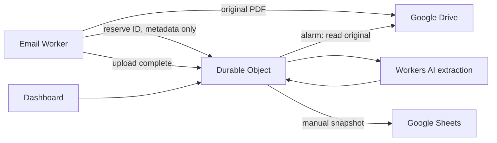

# Invoice categorizer

Forward an invoice PDF to an email address on your Cloudflare domain. The Worker uploads the original to your Google Drive, extracts invoice fields with Workers AI, and records the expense in a SQLite-backed Durable Object. A React + Kumo dashboard shows expenses, totals per currency, review notes, and Google connection settings.

## What v1 includes

- Exact receiving address and sender allowlist in Wrangler.
- PDF attachments with selectable text, up to 8 MiB each, five per message, and a 12 MiB total message limit.
- Direct upload from the email Worker to Drive. **No R2 and no PDF bytes in the Durable Object.** MIME parsing temporarily buffers the bounded attachment in Worker memory.
- SHA-256 expense IDs for exact-content duplicate detection and preallocated Drive IDs for upload retries.
- Durable Object alarm processing with up to three automatic attempts, plus dashboard retries.
- Vendor, invoice number, date, currency, subtotal, tax, total, and a fixed expense category.
- Separate spend totals by currency. Only ready records contribute to totals; no currency conversion.
- Manual Google Sheets snapshot export with expense IDs and original-file links.
- Cloudflare Access JWT verification for the dashboard, assets, API, and OAuth callback.

Photos and scanned PDFs require OCR and are not supported yet. Extraction can be wrong even when arithmetic is consistent; review original invoices when needed. Review records currently support reprocessing, not manual field editing. The dashboard is an all-time ledger suitable for personal volumes, not a paginated accounting system.

## Deploy

1. Clone the repository and run `pnpm install` at its root.
2. Run `pnpm --filter @automations/invoice-categorizer exec wrangler login`, then `wrangler whoami` to identify the account.
3. Copy `wrangler.jsonc` to `wrangler.local.jsonc` in this package. This local file is ignored by Git. Set `account_id`, `APP_URL`, `INVOICE_EMAIL`, `ALLOWED_SENDERS`, and `OWNER_EMAIL`. Use an exact email address for each sender. Keep placeholders out of a usable deployment.
4. Create a self-hosted Cloudflare Access application covering the entire dashboard hostname, including `/api/*`. Add an **Allow** policy for the owner's exact email. Enable an identity provider or one-time PIN login. Set `ACCESS_TEAM_DOMAIN` to the team hostname, such as `your-team.cloudflareaccess.com`, and `ACCESS_AUD` to the application's audience tag. The code checks signature, issuer, audience, expiry, and owner email. Missing settings return 403; there is no development or production bypass.
5. Build using the local configuration and deploy:

   ```sh
   cd packages/invoice-categorizer
   pnpm deploy:local
   ```

6. In the receiving domain's Email Routing settings, add an exact address rule with action **Send to a Worker**, selecting `invoice-categorizer`. Setting `INVOICE_EMAIL` in Wrangler validates the recipient but does not create this routing rule. Enable Email Routing DNS only on a domain or subdomain designated for it. Do not replace an existing mail provider's MX records.
7. Verify that an unsigned request cannot read `/`, `/api/dashboard`, or asset URLs. Then sign in through Access as the owner.
8. Complete Google setup below before sending invoices.

For a public fork, you may edit `wrangler.jsonc` directly and use `pnpm deploy`. For private deployment configuration, `deploy:local` passes the ignored file to both the Vite build and Wrangler, avoiding accidental deployment of placeholder bindings.

The Worker name is `invoice-categorizer`; the Durable Object binding is `LEDGER`. The initial SQLite migration runs at deployment. Do not rename the Worker or object binding casually: they identify the persistent ledger.

## Google OAuth

Create a Google Cloud project and enable **Google Drive API** and **Google Sheets API**. Configure the consent screen and a **Web application** OAuth client.

- Authorized redirect URI: `https://YOUR-DASHBOARD-HOST/api/google/callback`.
- Requested scope: `https://www.googleapis.com/auth/drive.file`. This limits access to files created or opened through this app. The app creates its own invoice folder and spreadsheet; it does not browse your existing Drive.
- Set `GOOGLE_CLIENT_ID` in your local Wrangler vars.
- Store the client secret without putting it in source control:

  ```sh
  pnpm exec wrangler secret put GOOGLE_CLIENT_SECRET --config wrangler.local.jsonc
  ```

Redeploy after changing vars. Open **Settings & connections → Connect Google**, and approve access. The server uses OAuth state, an HttpOnly cookie, and PKCE. The refresh token stays in server-side Durable Object storage, encrypted at rest by Cloudflare, and is never returned to the dashboard. Disconnect removes the stored refresh token; revoke the app in Google Account settings to revoke the grant itself.

Google OAuth apps in external Testing mode can have short-lived refresh tokens. Configure the appropriate publishing status for unattended use. Reconnect if Google revokes or expires the grant.

Changing Google accounts does not migrate the existing Drive originals. Reconnect the same account for an existing ledger, or deploy a separate instance for another account.

## Processing and recovery



The ingress Worker parses MIME, validates the sender and attachment, reserves the expense ID, uploads to Drive, and marks the record queued. The Durable Object stores records, configuration, retry state, OAuth state, and credentials only.

If the upload succeeds but its acknowledgment is lost, a later alarm reads the preallocated Drive ID and continues. If an upload fails before Drive receives it, resend the original email; no persistent local copy exists. Retrying extraction reads the original from Drive. Files deleted from Drive must be restored or resent. Three failed attempts leave an actionable record rather than retrying forever.

The sender's envelope address and visible From address must both be in `ALLOWED_SENDERS`. Cloudflare's routing service performs email authentication; the handler also requires a DMARC pass in the ingress authentication results. Forward invoices as a new message from your allowed mailbox, not through a forwarding chain that rewrites the envelope. Validate your provider's delivered authentication headers during setup.

Sheets sync writes a deterministic snapshot using RAW values, so repeated clicks do not append duplicate expenses or interpret document strings as formulas. The first tab is app-owned. Do not put manual edits or formulas there. A stable app property helps recover spreadsheet creation after an uncertain network response; Google Workspace files do not support preallocated IDs, so an ambiguous initial creation can still require reconciling an extra empty spreadsheet.

The queue allows 25 active records. An upload is not accepted as durable until Drive stores it. PDFs are not saved in logs. Automatic processing uses a fixed taxonomy in `src/server/domain.ts`; edit it and redeploy to change categories.

## Development and verification

```sh
pnpm check
pnpm lint
pnpm test
pnpm build
pnpm --filter @automations/invoice-categorizer dev
```

Local backend requests still require a valid Access token. Unit tests generate test-only signing keys; production has no fake identity mode. Use a development Access-protected hostname for an authenticated end-to-end test. Automated tests cover identity verification, amount validation, duplicate handling, and external API failure behavior. Live Google OAuth and real email receipt require your own connected accounts.

Workers AI and Durable Object usage can incur Cloudflare charges. This project does not provision R2. Drive files count against your Google account storage.

## Roadmap

- OCR for scanned PDFs and receipt photos, evaluated against actual bill samples.
- Manual corrections and review approval.
- Scheduled Sheets synchronization and richer date/category analytics.
- Optional Ramp reimbursement integration.
- Pagination and retention controls for larger ledgers.
